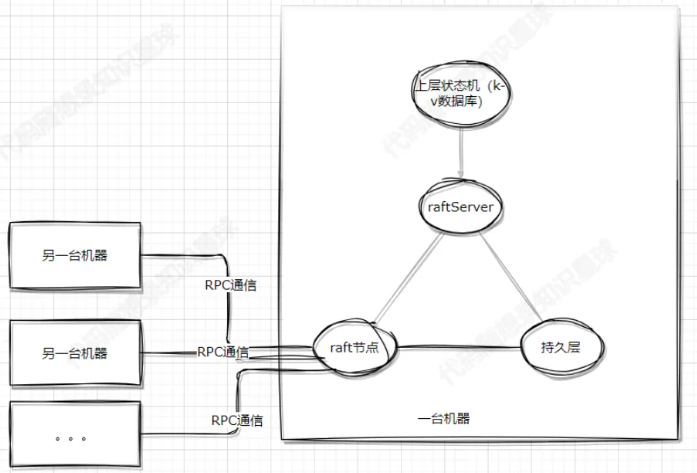

# Raft-based k-v storage

https://www.yuque.com/chengxuyuancarl/kkiykz pwd: tr8q

## Basics

### 1. **CAP Theorem**

The **CAP Theorem** says that a distributed system can only **guarantee two out of the following three** properties at the same time:

- **Consistency (C)**: All nodes see the same data at the same time.
- **Availability (A)**: Every request receives a (non-error) response — even if it may not be the latest data.
- **Partition Tolerance (P)**: The system continues to operate even if network failures (partitions) occur between nodes.

💡 In real-world systems, **Partition Tolerance is a must**, so we typically trade off between:

- **CP** (Consistency + Partition tolerance)
- **AP** (Availability + Partition tolerance)

------

### 2. **Consensus Protocol – Raft**

In a distributed system, you often need multiple machines to agree on a value (like logs or config). This is called **consensus**, and **Raft** is a popular algorithm for this.

Key ideas in **Raft**:

- A **leader** node is elected and handles all writes.
- **Followers** replicate the leader's log entries.
- If the leader fails, a new one is **elected**.
- It ensures **strong consistency** across nodes.

Raft is easier to understand than Paxos, and is widely used in systems like etcd, Consul, and TiKV.

------

### 3. **Data Replication**

Data replication means **copying data across multiple nodes** to improve:

- **Availability**: if one node fails, others can still serve data.
- **Fault tolerance**: no single point of failure.

There are two main strategies:

- **Synchronous replication**: data is written to all replicas before confirming success (strong consistency).
- **Asynchronous replication**: writes succeed after writing to a leader, and propagate to followers later (higher availability).

------

### 4. **Failure Handling & Recovery**

Distributed systems must tolerate:

- **Node crashes**
- **Network issues**
- **Data corruption**

Common techniques:

- **Heartbeat monitoring**: to detect if a node is alive
- **Leader election**: to promote a new leader if the current one fails
- **Log replay & checkpointing**: to restore system state

## Raft basics



The system can generally be divided into the following parts:

- **raft node**: The core of the Raft algorithm. It is responsible for communicating with raft nodes on other machines to achieve distributed consensus.
- **raftServer**: Coordinates between the raft node and the key-value (K-V) database. It may optionally persist the data in the K-V store.
- **Upper Layer State Machine (K-V Database)**: A replicated data store.
- **Persistent Layer**: Responsible for persisting relevant data. For the raft node, it must persist certain key logs according to consensus requirements to ensure data recovery after restarts or crashes. The raftServer may also persist some K-V database data.
- **RPC Communication**: Used for leader election, log replication, data queries, heartbeat checks, and other crucial interactions between raft nodes. It provides a lightweight and simple communication mechanism.

Raft divides all nodes in the system into three roles: **Follower**, **Candidate**, and **Leader**. The election mechanism ensures one node becomes the leader, which processes client requests and updates followers.

the time for nodes to know the leader dead is random. first know node become candidate. have the longest log -> data is the freshest -> leader

log entry:

- index (monotonically increase)
- term index

logs are being appended, not committed. no nodes knows if the leader is able to reach other nodes. if some nodes die it cannot have latest data.

leader wait for response. more than 1/2 ok means success. Then the leader go ahead and commit the log. it will tell the follower to commit too.

leader send curr and prev entry

FSM end up with the same state

### Key concepts

1. **State Machine**: The upper-layer application of raft, e.g., a K-V store like Redis.
2. **Log, Term, Entry**:
   - Log: Stores client command requests as log entries.
   - Entry: Each log entry can be seen as part of a continuous array.
3. **Commit**: After a log is stored and replicated, it is committed—applied to the state machine.
4. **Node Roles**: Follower, Candidate, Leader.
5. **Election**: When a Follower times out, it becomes a Candidate and may be elected Leader.
6. **Term**: Each log is associated with a term indicating when (under which leader) it was created.
7. **Heartbeat and Log Sync**: The Leader sends heartbeats (AppendEntryRPC) to maintain leadership and synchronize logs.

### In-Depth Concepts

#### 1. Log

Logs store client commands, and Raft ensures that all nodes have identical logs, ensuring state machine consistency.

- All nodes start as Followers.
- If no heartbeat is received, a Follower becomes a Candidate.
- Candidates send vote requests. If a majority is reached, it becomes the Leader.
- The Leader handles log replication and commands to the K-V store.

> If a Candidate or Leader notices its term is outdated (compared to another node’s), it steps down to Follower.

#### 2. Term

A **Term** is a logical clock used to determine the freshness of logs or leadership. Terms increment when elections are initiated.

- A **Leader** is defined within a Term.
- A Candidate must win a **majority** to become Leader.
- If no majority is reached, a new election with a new Term begins.

**Why only one Leader per Term?**
 Because each node can only vote once per Term, only one Candidate can get a majority.

**What if a node has an outdated Term?**

- **Leaders/Candidates**: Step down to Follower and update to the latest Term.
- **Followers**: Simply update their Term.

This avoids split-brain scenarios and ensures safety.

#### 3. Leader Election Process

Raft is a **strong leader model**: only the leader handles client requests.

**How does a Follower detect Leader failure?**
 If no `AppendEntry` (heartbeat) is received within a timeout, it starts an election.

- AppendEntry acts as both heartbeat and log sync message.
- Election timeout is randomized to avoid vote splits.

**Who can become Leader?**
 Only Candidates whose logs are **not older** than the recipient’s log can receive votes.

Log freshness is determined by:

```
cppCopyEditif (term1 != term2)
    newer = higher term;
else
    newer = higher index;
```

#### 4. Log Replication and Heartbeat

Heartbeat and log sync use the same `AppendEntryRPC`.

**Why not send the entire log to Followers?**
 Too inefficient. Instead, identify the last matching entry and only sync new logs.

**How does the Leader know if logs match?**
 Each `AppendEntryRPC` includes the previous log’s index and term.

**If mismatched?**
 The Leader retries with earlier entries until a match is found, then continues sync from there.

Raft ensures:

1. If two logs have the same index and term, they have identical content.
2. If two logs share an entry (same index and term), all earlier entries must match too.

How is this ensured?

- Only the Leader can generate log entries.
- The Leader verifies Followers' logs by comparing terms and indexes. If mismatched, it backs up and retries until a match is found.

Consensus Theory: Once a decision is made by a majority, it's **final** and **safe** (cannot be overwritten). Even if a minority of nodes fail, the system continues. If a majority fails, the system halts safely (but never gives wrong results).

## Source code

### src

#### raft.h

- `#ifndef RAFT_H`: **include guards**. This checks if the macro `RAFT_H` has **not** been defined.
- `#define RAFT_H`: If it hasn't, this line defines it.
- The contents of the file follow.
- `#endif`: This ends the conditional block.

So, the **first time** the compiler includes this header, it defines `RAFT_H`, and the contents are processed.

If the file is included **again** later (in the same compilation unit), the `#ifndef` check will fail, and the compiler **skips** the entire file content.

In modern C++ (since C++20), you can use: `#pragma once`