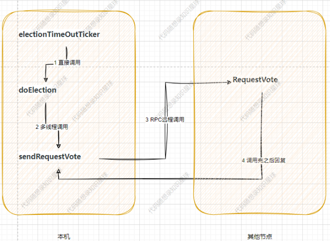
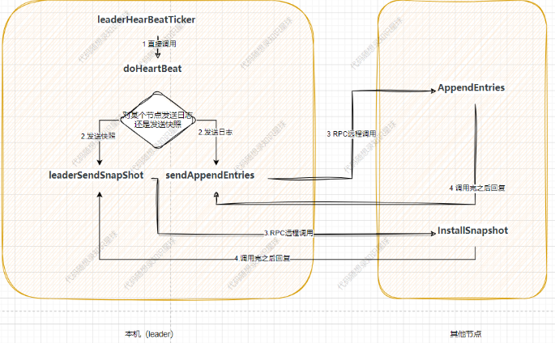

# Raft-based k-v storage

https://www.yuque.com/chengxuyuancarl/kkiykz pwd: tr8q

## Basics

### 1. **CAP Theorem**

The **CAP Theorem** says that a distributed system can only **guarantee two out of the following three** properties at the same time:

- **Consistency (C)**: All nodes see the same data at the same time.
- **Availability (A)**: Every request receives a (non-error) response — even if it may not be the latest data.
- **Partition Tolerance (P)**: The system continues to operate even if network failures (partitions) occur between nodes.

💡 In real-world systems, **Partition Tolerance is a must**, so we typically trade off between:

- **CP** (Consistency + Partition tolerance)
- **AP** (Availability + Partition tolerance)

------

### 2. **Consensus Protocol – Raft**

In a distributed system, you often need multiple machines to agree on a value (like logs or config). This is called **consensus**, and **Raft** is a popular algorithm for this.

Key ideas in **Raft**:

- A **leader** node is elected and handles all writes.
- **Followers** replicate the leader's log entries.
- If the leader fails, a new one is **elected**.
- It ensures **strong consistency** across nodes.

Raft is easier to understand than Paxos, and is widely used in systems like etcd, Consul, and TiKV.

------

### 3. **Data Replication**

Data replication means **copying data across multiple nodes** to improve:

- **Availability**: if one node fails, others can still serve data.
- **Fault tolerance**: no single point of failure.

There are two main strategies:

- **Synchronous replication**: data is written to all replicas before confirming success (strong consistency).
- **Asynchronous replication**: writes succeed after writing to a leader, and propagate to followers later (higher availability).

------

### 4. **Failure Handling & Recovery**

Distributed systems must tolerate:

- **Node crashes**
- **Network issues**
- **Data corruption**

Common techniques:

- **Heartbeat monitoring**: to detect if a node is alive
- **Leader election**: to promote a new leader if the current one fails
- **Log replay & checkpointing**: to restore system state

## Raft basics


The system can generally be divided into the following parts:

- **raft node**: The core of the Raft algorithm. It is responsible for communicating with raft nodes on other machines to achieve distributed consensus.
- **raftServer**: Coordinates between the raft node and the key-value (K-V) database. It may optionally persist the data in the K-V store.
- **Upper Layer State Machine (K-V Database)**: A replicated data store.
- **Persistent Layer**: Responsible for persisting relevant data. For the raft node, it must persist certain key logs according to consensus requirements to ensure data recovery after restarts or crashes. The raftServer may also persist some K-V database data.
- **RPC Communication**: Used for leader election, log replication, data queries, heartbeat checks, and other crucial interactions between raft nodes. It provides a lightweight and simple communication mechanism.

Raft divides all nodes in the system into three roles: **Follower**, **Candidate**, and **Leader**. The election mechanism ensures one node becomes the leader, which processes client requests and updates followers.

the time for nodes to know the leader dead is random. first know node become candidate. have the longest log -> data is the freshest -> leader

log entry:

- index (monotonically increase)
- term index

logs are being appended, not committed. no nodes knows if the leader is able to reach other nodes. if some nodes die it cannot have latest data.

leader wait for response. more than 1/2 ok means success. Then the leader go ahead and commit the log. it will tell the follower to commit too.

When the leader sends an `AppendEntries` RPC to a follower, it includes:

- `prevLogIndex`: Index of the log entry immediately preceding the new ones.
- `prevLogTerm`: Term of the `prevLogIndex` entry.

if not matched, The leader maintains a `nextIndex[i]` array:

- It records the index of the **next log entry** it wants to send to follower `i` (decrement).

until the follower finds a match.

FSM end up with the same state

### Key concepts

1. **State Machine**: The upper-layer application of raft, e.g., a K-V store like Redis.
2. **Log, Term, Entry**:
   - Log: Stores client command requests as log entries.
   - Entry: Each log entry can be seen as part of a continuous array.
3. **Commit**: After a log is stored and replicated, it is committed—applied to the state machine.
4. **Node Roles**: Follower, Candidate, Leader.
5. **Election**: When a Follower times out, it becomes a Candidate and may be elected Leader.
6. **Term**: Each log is associated with a term indicating when (under which leader) it was created.
7. **Heartbeat and Log Sync**: The Leader sends heartbeats (AppendEntryRPC) to maintain leadership and synchronize logs.

### In-Depth Concepts

#### 1. Log

Logs store client commands, and Raft ensures that all nodes have identical logs, ensuring state machine consistency.

- All nodes start as Followers.
- If no heartbeat is received, a Follower becomes a Candidate.
- Candidates send vote requests. If a majority is reached, it becomes the Leader.
- The Leader handles log replication and commands to the K-V store.

> If a Candidate or Leader notices its term is outdated (compared to another node’s), it steps down to Follower.

#### 2. Term

A **Term** is a logical clock used to determine the freshness of logs or leadership. Terms increment when elections are initiated.

- A **Leader** is defined within a Term.
- A Candidate must win a **majority** to become Leader.
- If no majority is reached, a new election with a new Term begins.

**Why only one Leader per Term?**
 Because each node can only vote once per Term, only one Candidate can get a majority.

**What if a node has an outdated Term?**

- **Leaders/Candidates**: Step down to Follower and update to the latest Term.
- **Followers**: Simply update their Term.

This avoids split-brain scenarios and ensures safety.

#### 3. Leader Election Process

Raft is a **strong leader model**: only the leader handles client requests.

**How does a Follower detect Leader failure?**
 If no `AppendEntry` (heartbeat) is received within a timeout, it starts an election.

- AppendEntry acts as both heartbeat and log sync message.
- Election timeout is randomized to avoid vote splits.

**Who can become Leader?**
 Only Candidates whose logs are **not older** than the recipient’s log can receive votes.

Log freshness is determined by:

```
cppCopyEditif (term1 != term2)
    newer = higher term;
else
    newer = higher index;
```

if client sent a request while the leader dies, it has to retry.

#### 4. Log Replication and Heartbeat

Heartbeat and log sync use the same `AppendEntryRPC`.

**Why not send the entire log to Followers?**
 Too inefficient. Instead, identify the last matching entry and only sync new logs.

**How does the Leader know if logs match?**
 Each `AppendEntryRPC` includes the previous log’s index and term.

**If mismatched?**
 The Leader retries with earlier entries until a match is found, then continues sync from there.

Raft ensures:

1. If two logs have the same index and term, they have identical content.
2. If two logs share an entry (same index and term), all earlier entries must match too.

How is this ensured?

- Only the Leader can generate log entries.
- The Leader verifies Followers' logs by comparing terms and indexes. If mismatched, it backs up and retries until a match is found.

Consensus Theory: Once a decision is made by a majority, it's **final** and **safe** (cannot be overwritten). Even if a minority of nodes fail, the system continues. If a majority fails, the system halts safely (but never gives wrong results).

#### 5. Snapshot

1. **Snapshots are local optimizations**

- Each node (leader or follower) **independently** takes a snapshot of its state machine to avoid unbounded log growth.
- The **snapshot saves the state up to a specific log index**, allowing the node to safely discard older log entries.

2. **Leader and follower snapshots are not synchronized**

- The **leader** might take a snapshot at a different time than its followers.
- Followers may lag behind or advance based on their log replication status and local policies (e.g. memory pressure or configured snapshot interval).

3. **Index coordination is handled via `InstallSnapshot` RPC**

- If a follower falls too far behind (e.g. it’s missing log entries that the leader has already compacted), the **leader will send an `InstallSnapshot` RPC**.
- This RPC brings the follower’s state machine and log index **up to the leader’s latest snapshot index**.

4. **Snapshot index advancement**

- Each node keeps track of the **last included index and term** in the snapshot.
- Once a snapshot is taken, those log entries prior to that index can be safely deleted.

## Source code

### src

#### raft

- `#ifndef RAFT_H`: **include guards**. This checks if the macro `RAFT_H` has **not** been defined.
- `#define RAFT_H`: If it hasn't, this line defines it.
- The contents of the file follow.
- `#endif`: This ends the conditional block.

So, the **first time** the compiler includes this header, it defines `RAFT_H`, and the contents are processed.

If the file is included **again** later (in the same compilation unit), the `#ifndef` check will fail, and the compiler **skips** the entire file content.

In modern C++ (since C++20), you can use: `#pragma once`


about **syntax**:

`const ::raftRpcProctoc::AppendEntriesArgs *request` means Start looking for `raftRpcProctoc` in the **global namespace**, not any nested or local one.

`const raftRpcProctoc::AppendEntriesArgs *request` means Start looking for `raftRpcProctoc` in the **current scope**, then parent scopes, then global

A **nested class** is a class defined **inside the scope of another class**.

**Syntactic sugar**. The `&` operator is overloaded so that:

- When you're **writing (saving)** data:
   `ar & data;` acts like `ar << data;`
- When you're **reading (loading)** data:
   `ar & data;` acts like `ar >> data;`

This makes it **bidirectional** — one unified syn


focus on:

**Main Raft Workflow**:

- **Leader Election**: via `sendRequestVote` and `RequestVote`
- **Log Replication & Heartbeats**: via `sendAppendEntries` and `AppendEntries`

**Timer Management**:

- `applierTicker`: periodically writes committed log entries to the state machine
- `leaderHearBeatTicker`: maintains heartbeat from the leader
- `electionTimeOutTicker`: triggers an election when no heartbeat is received within a timeout

**Persistence**:

- **What to persist**: includes current term, voted candidate, and log entries
- **When to persist**: persistence occurs when these values change, via the `persist()` function


```C++
  m_ioManager = std::make_unique<monsoon::IOManager>(FIBER_THREAD_NUM, FIBER_USE_CALLER_THREAD);

  // start ticker fiber to start elections
  // 启动三个循环定时器
  // todo:原来是启动了三个线程，现在是直接使用了协程，三个函数中leaderHearBeatTicker
  // 、electionTimeOutTicker执行时间是恒定的，applierTicker时间受到数据库响应延迟和两次apply之间请求数量的影响，这个随着数据量增多可能不太合理，最好其还是启用一个线程。
  m_ioManager->scheduler([this]() -> void { this->leaderHearBeatTicker(); });
  m_ioManager->scheduler([this]() -> void { this->electionTimeOutTicker(); });

  std::thread t3(&Raft::applierTicker, this);
  t3.detach();
```

- **Schedule `leaderHearBeatTicker()` and `electionTimeOutTicker()` to run as fibers.**
- Each ticker function:
  - runs a **loop** that periodically performs:
    - Leader: sends heartbeats
    - Follower/candidate: checks for election timeout and starts election if needed

➡️ These **tickers execute periodically** with **constant timing**, making sure that Raft’s time-based behaviors (elections, heartbeats) function properly.

for `applierTicker`, it has to use thread because fibers cannot handle blocking operations. if it blocks, the entire thread running that fiber is blocked. no other fiber on that thread can run.


### election

**electionTimeOutTicker**



- **`electionTimeOutTicker`:**
   Responsible for checking whether an election should be initiated. If so, it calls `doElection` to start the election.
- **`doElection`:**
   Actually initiates the election by constructing the necessary RPCs and using multiple threads to call `sendRequestVote` to handle the RPCs and responses.

- **`sendRequestVote`:**
   Responsible for sending the election-related RPCs. After sending the RPCs, it also handles receiving and processing the responses from peers.

- **`RequestVote`:**
   Receives election requests from others and primarily checks whether it should vote for the requester.

```C++
while (true) {
  if I'm the leader, sleep shortly and skip election logic;
  calculate how long to sleep based on randomized timeout;
  sleep for that duration;
  if someone reset the election timer during sleep, skip election;
  else, call doElection() to start the election;
}
```


voting rules:

Each **follower node** follows **strict rules** to decide whether to grant its vote:

✅ A node **will vote for the candidate** *only if*:

- The candidate’s term is **at least as up-to-date** as its own (`args->term >= m_currentTerm`).
- The follower **has not already voted** in this term (`m_votedFor == -1` or `m_votedFor == candidateId`).
- The candidate’s log is at least as up-to-date as the follower’s (based on `lastLogIndex` and `lastLogTerm`).

❌ Otherwise, it **denies** the vote.


`.get()` is a method on `std::shared_ptr<T>` that returns a **raw pointer** of type `T*`.

mutex:

```C++
std::mutex m;

m.lock();     // acquire the lock
// critical section
m.unlock();   // release the lock ❌ might forget this if there's a return or exception


{
    std::lock_guard<std::mutex> lg(m_mtx);
    // critical section is protected
}  // lg is destroyed here, and the mutex is automatically unlocked
```


the reason that we don't stop `sendRequestVote` when it become leader:

`   std::thread t(&Raft::sendRequestVote, this, i, requestVoteArgs, requestVoteReply, votedNum);  // 创建新线程并执行b函数，并传递参数` Here **You can't "cancel" a detached thread** in C++ safely (there’s no built-in cooperative cancelation). The best way is to


when to call `persist()`:

1. After changing `currentTerm` or `votedFor`
2. After appending new log entries
3. After becoming follower due to receiving higher term


```
DEFER {
    cleanup_function();
};
```

Means:

"Run cleanup_function() automatically when this scope ends."


This snippet:

```c++
std::stringstream ss; // Acts like an in-memory file. Used to hold the serialized text data.

boost::archive::text_oarchive oa(ss); // This creates an output archive that serializes objects into ss in a text-based format (like plain text or readable binary).

oa << boostPersistRaftNode; // This writes the content of boostPersistRaftNode into the archive (and thus into ss) using Boost's reflection macros (BOOST_SERIALIZATION_*). All member fields that have serialize(...) defined will be included.

return ss.str(); //Returns the full serialized result as a std::string.
```

is using **Boost.Serialization** to **serialize an object to a string** — specifically:

> Convert the `boostPersistRaftNode` (a C++ struct/class) into a **string of bytes** that can be stored persistently (e.g., on disk or in memory).


NOTICE:

`std::shared_ptr<int> votedNum = std::make_shared<int>(1);`

`std::shared_ptr` is thread-safe for copying and assigning the pointer itself — but not for accessing or modifying the object it points to.

solution: use atomic or mutex.

### log replication & heartbeat



**`leaderHearBeatTicker`:**
 Responsible for checking whether it's time to send a heartbeat. If so, it triggers `doHeartBeat`.

**`doHeartBeat`:**
 Actually sends the heartbeat. It constructs the necessary RPCs to be sent and uses multithreading to call `sendAppendEntries`, which handles both the sending of the RPC and processing of the response.

**`sendAppendEntries`:**
 Responsible for sending the log-related RPCs. After sending the RPC, it also handles receiving and processing the response from the peer.

**`leaderSendSnapShot`:**
 Responsible for sending snapshot RPCs. After sending the RPC, it also handles receiving and processing the response from the peer.

**`AppendEntries`:**
 Handles log requests sent by the leader. It mainly checks whether the current log matches and synchronizes the leader's log entries to the local node.

**`InstallSnapshot`:**
 Handles snapshot requests sent by the leader, synchronizing the snapshot to the local node.


logic for `m_matchIndex` and `m_nextIndex`:

1. **Leader sends logs** starting at `m_nextIndex[i]` to follower `i`.

2. **Follower replies**: success or failure.

   - If **success**:

     - Leader updates:

       ```
       m_matchIndex[i] = new match index;
       m_nextIndex[i] = m_matchIndex[i] + 1;
       ```

   - If **failure**:

     - Follower is behind → leader decrements `m_nextIndex[i]` and retries.


logic of `doHeartBeat`

When triggered (by `leaderHearBeatTicker()`), `doHeartBeat()` does the following:

- Ensures only the **leader** runs this.
- Iterates over all **followers** (i.e., all peers except itself).
- For each follower:
  - If it’s too far behind → send a **snapshot** (via `InstallSnapshot` RPC).
  - Otherwise → send **AppendEntries** RPC containing log entries or heartbeat.
- Each operation runs in a **separate thread** for concurrency.
- Resets the leader’s heartbeat timestamp after all sends are dispatched.