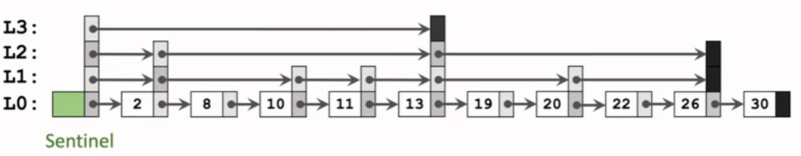

# Raft-based k-v storage

https://www.yuque.com/chengxuyuancarl/kkiykz pwd: tr8q

## Basics

### 1. **CAP Theorem**

The **CAP Theorem** says that a distributed system can only **guarantee two out of the following three** properties at the same time:

- **Consistency (C)**: All nodes see the same data at the same time.
- **Availability (A)**: Every request receives a (non-error) response — even if it may not be the latest data.
- **Partition Tolerance (P)**: The system continues to operate even if network failures (partitions) occur between nodes.

💡 In real-world systems, **Partition Tolerance is a must**, so we typically trade off between:

- **CP** (Consistency + Partition tolerance)
- **AP** (Availability + Partition tolerance)

**RAII** stands for **Resource Acquisition Is Initialization**. 

- When an object is created (constructed), it **acquires** some resource.
- When the object goes out of scope (destroyed), its **destructor** automatically releases the resource.

------

### 2. **Consensus Protocol – Raft**

In a distributed system, you often need multiple machines to agree on a value (like logs or config). This is called **consensus**, and **Raft** is a popular algorithm for this.

Key ideas in **Raft**:

- A **leader** node is elected and handles all writes.
- **Followers** replicate the leader's log entries.
- If the leader fails, a new one is **elected**.
- It ensures **strong consistency** across nodes.

Raft is easier to understand than Paxos, and is widely used in systems like etcd, Consul, and TiKV.

------

### 3. **Data Replication**

Data replication means **copying data across multiple nodes** to improve:

- **Availability**: if one node fails, others can still serve data.
- **Fault tolerance**: no single point of failure.

There are two main strategies:

- **Synchronous replication**: data is written to all replicas before confirming success (strong consistency).
- **Asynchronous replication**: writes succeed after writing to a leader, and propagate to followers later (higher availability).

------

### 4. **Failure Handling & Recovery**

Distributed systems must tolerate:

- **Node crashes**
- **Network issues**
- **Data corruption**

Common techniques:

- **Heartbeat monitoring**: to detect if a node is alive
- **Leader election**: to promote a new leader if the current one fails
- **Log replay & checkpointing**: to restore system state

## Raft basics


The system can generally be divided into the following parts:

- **raft node**: The core of the Raft algorithm. It is responsible for communicating with raft nodes on other machines to achieve distributed consensus.
- **raftServer**: Coordinates between the raft node and the key-value (K-V) database. It may optionally persist the data in the K-V store.
- **Upper Layer State Machine (K-V Database)**: A replicated data store.
- **Persistent Layer**: Responsible for persisting relevant data. For the raft node, it must persist certain key logs according to consensus requirements to ensure data recovery after restarts or crashes. The raftServer may also persist some K-V database data.
- **RPC Communication**: Used for leader election, log replication, data queries, heartbeat checks, and other crucial interactions between raft nodes. It provides a lightweight and simple communication mechanism.

Raft divides all nodes in the system into three roles: **Follower**, **Candidate**, and **Leader**. The election mechanism ensures one node becomes the leader, which processes client requests and updates followers.

the time for nodes to know the leader dead is random. first know node become candidate. have the longest log -> data is the freshest -> leader

log entry:

- index (monotonically increase)
- term index

logs are being appended, not committed. no nodes knows if the leader is able to reach other nodes. if some nodes die it cannot have latest data.

leader wait for response. more than 1/2 ok means success. Then the leader go ahead and commit the log. it will tell the follower to commit too.

When the leader sends an `AppendEntries` RPC to a follower, it includes:

- `prevLogIndex`: Index of the log entry immediately preceding the new ones.
- `prevLogTerm`: Term of the `prevLogIndex` entry.

if not matched, The leader maintains a `nextIndex[i]` array:

- It records the index of the **next log entry** it wants to send to follower `i` (decrement).

until the follower finds a match.

FSM end up with the same state

### Key concepts

1. **State Machine**: The upper-layer application of raft, e.g., a K-V store like Redis.
2. **Log, Term, Entry**:
   - Log: Stores client command requests as log entries.
   - Entry: Each log entry can be seen as part of a continuous array.
3. **Commit**: After a log is stored and replicated, it is committed—applied to the state machine.
4. **Node Roles**: Follower, Candidate, Leader.
5. **Election**: When a Follower times out, it becomes a Candidate and may be elected Leader.
6. **Term**: Each log is associated with a term indicating when (under which leader) it was created.
7. **Heartbeat and Log Sync**: The Leader sends heartbeats (AppendEntryRPC) to maintain leadership and synchronize logs.

### In-Depth Concepts

#### 1. Log

Logs store client commands, and Raft ensures that all nodes have identical logs, ensuring state machine consistency.

- All nodes start as Followers.
- If no heartbeat is received, a Follower becomes a Candidate.
- Candidates send vote requests. If a majority is reached, it becomes the Leader.
- The Leader handles log replication and commands to the K-V store.

> If a Candidate or Leader notices its term is outdated (compared to another node’s), it steps down to Follower.

#### 2. Term

A **Term** is a logical clock used to determine the freshness of logs or leadership. Terms increment when elections are initiated.

- A **Leader** is defined within a Term.
- A Candidate must win a **majority** to become Leader.
- If no majority is reached, a new election with a new Term begins.

**Why only one Leader per Term?**
 Because each node can only vote once per Term, only one Candidate can get a majority.

**What if a node has an outdated Term?**

- **Leaders/Candidates**: Step down to Follower and update to the latest Term.
- **Followers**: Simply update their Term.

This avoids split-brain scenarios and ensures safety.

#### 3. Leader Election Process

Raft is a **strong leader model**: only the leader handles client requests.

**How does a Follower detect Leader failure?**
 If no `AppendEntry` (heartbeat) is received within a timeout, it starts an election.

- AppendEntry acts as both heartbeat and log sync message.
- Election timeout is randomized to avoid vote splits.

**Who can become Leader?**
 Only Candidates whose logs are **not older** than the recipient’s log can receive votes.

Log freshness is determined by:

```
if (term1 != term2)
    newer = higher term;
else
    newer = higher index;
```

if client sent a request while the leader dies, it has to retry.

#### 4. Log Replication and Heartbeat

Heartbeat and log sync use the same `AppendEntryRPC`.

**Why not send the entire log to Followers?**
 Too inefficient. Instead, identify the last matching entry and only sync new logs.

**How does the Leader know if logs match?**
 Each `AppendEntryRPC` includes the previous log’s index and term.

**If mismatched?**
 The Leader retries with earlier entries until a match is found, then continues sync from there.

Raft ensures:

1. If two logs have the same index and term, they have identical content.
2. If two logs share an entry (same index and term), all earlier entries must match too.

How is this ensured?

- Only the Leader can generate log entries.
- The Leader verifies Followers' logs by comparing terms and indexes. If mismatched, it backs up and retries until a match is found.

Consensus Theory: Once a decision is made by a majority, it's **final** and **safe** (cannot be overwritten). Even if a minority of nodes fail, the system continues. If a majority fails, the system halts safely (but never gives wrong results).

#### 5. Snapshot

1. **Snapshots are local optimizations**

- Each node (leader or follower) **independently** takes a snapshot of its state machine to avoid unbounded log growth.
- The **snapshot saves the state up to a specific log index**, allowing the node to safely discard older log entries.

2. **Leader and follower snapshots are not synchronized**

- The **leader** might take a snapshot at a different time than its followers.
- Followers may lag behind or advance based on their log replication status and local policies (e.g. memory pressure or configured snapshot interval).

3. **Index coordination is handled via `InstallSnapshot` RPC**

- If a follower falls too far behind (e.g. it’s missing log entries that the leader has already compacted), the **leader will send an `InstallSnapshot` RPC**.
- This RPC brings the follower’s state machine and log index **up to the leader’s latest snapshot index**.

4. **Snapshot index advancement**

- Each node keeps track of the **last included index and term** in the snapshot.
- Once a snapshot is taken, those log entries prior to that index can be safely deleted.

## Source code

- example
  - raftCoreExample:
    - caller: initiate client to do `client.Put("x", std::to_string(tmp))`
    - raftKvDB: 


### raft

- `#ifndef RAFT_H`: **include guards**. This checks if the macro `RAFT_H` has **not** been defined.
- `#define RAFT_H`: If it hasn't, this line defines it.
- The contents of the file follow.
- `#endif`: This ends the conditional block.

So, the **first time** the compiler includes this header, it defines `RAFT_H`, and the contents are processed.

If the file is included **again** later (in the same compilation unit), the `#ifndef` check will fail, and the compiler **skips** the entire file content.

In modern C++ (since C++20), you can use: `#pragma once`


about **syntax**:

`const ::raftRpcProctoc::AppendEntriesArgs *request` means Start looking for `raftRpcProctoc` in the **global namespace**, not any nested or local one.

`const raftRpcProctoc::AppendEntriesArgs *request` means Start looking for `raftRpcProctoc` in the **current scope**, then parent scopes, then global

A **nested class** is a class defined **inside the scope of another class**.

**Syntactic sugar**. The `&` operator is overloaded so that:

- When you're **writing (saving)** data:
   `ar & data;` acts like `ar << data;`
- When you're **reading (loading)** data:
   `ar & data;` acts like `ar >> data;`

This makes it **bidirectional** — one unified syn


focus on:

**Main Raft Workflow**:

- **Leader Election**: via `sendRequestVote` and `RequestVote`
- **Log Replication & Heartbeats**: via `sendAppendEntries` and `AppendEntries`

**Timer Management**:

- `applierTicker`: periodically writes committed log entries to the state machine
- `leaderHearBeatTicker`: maintains heartbeat from the leader
- `electionTimeOutTicker`: triggers an election when no heartbeat is received within a timeout

**Persistence**:

- **What to persist**: includes current term, voted candidate, and log entries
- **When to persist**: persistence occurs when these values change, via the `persist()` function


```C++
  m_ioManager = std::make_unique<monsoon::IOManager>(FIBER_THREAD_NUM, FIBER_USE_CALLER_THREAD);

  // start ticker fiber to start elections
  // 启动三个循环定时器
  // todo:原来是启动了三个线程，现在是直接使用了协程，三个函数中leaderHearBeatTicker
  // 、electionTimeOutTicker执行时间是恒定的，applierTicker时间受到数据库响应延迟和两次apply之间请求数量的影响，这个随着数据量增多可能不太合理，最好其还是启用一个线程。
  m_ioManager->scheduler([this]() -> void { this->leaderHearBeatTicker(); });
  m_ioManager->scheduler([this]() -> void { this->electionTimeOutTicker(); });

  std::thread t3(&Raft::applierTicker, this);
  t3.detach();
```

- **Schedule `leaderHearBeatTicker()` and `electionTimeOutTicker()` to run as fibers.**
- Each ticker function:
  - runs a **loop** that periodically performs:
    - Leader: sends heartbeats
    - Follower/candidate: checks for election timeout and starts election if needed

➡️ These **tickers execute periodically** with **constant timing**, making sure that Raft’s time-based behaviors (elections, heartbeats) function properly.

for `applierTicker`, it has to use thread because fibers cannot handle blocking operations. if it blocks, the entire thread running that fiber is blocked. no other fiber on that thread can run.


### election

**electionTimeOutTicker**


- **`electionTimeOutTicker`:**
   Responsible for checking whether an election should be initiated. If so, it calls `doElection` to start the election.
- **`doElection`:**
   Actually initiates the election by constructing the necessary RPCs and using multiple threads to call `sendRequestVote` to handle the RPCs and responses.

- **`sendRequestVote`:**
   Responsible for sending the election-related RPCs. After sending the RPCs, it also handles receiving and processing the responses from peers.

- **`RequestVote`:**
   Receives election requests from others and primarily checks whether it should vote for the requester.

```C++
while (true) {
  if I'm the leader, sleep shortly and skip election logic;
  calculate how long to sleep based on randomized timeout;
  sleep for that duration;
  if someone reset the election timer during sleep, skip election;
  else, call doElection() to start the election;
}
```


voting rules:

Each **follower node** follows **strict rules** to decide whether to grant its vote:

✅ A node **will vote for the candidate** *only if*:

- The candidate’s term is **at least as up-to-date** as its own (`args->term >= m_currentTerm`).
- The follower **has not already voted** in this term (`m_votedFor == -1` or `m_votedFor == candidateId`).
- The candidate’s log is at least as up-to-date as the follower’s (based on `lastLogIndex` and `lastLogTerm`).

❌ Otherwise, it **denies** the vote.


`.get()` is a method on `std::shared_ptr<T>` that returns a **raw pointer** of type `T*`.

mutex:

```C++
std::mutex m;

m.lock();     // acquire the lock
// critical section
m.unlock();   // release the lock ❌ might forget this if there's a return or exception


{
    std::lock_guard<std::mutex> lg(m_mtx);
    // critical section is protected
}  // lg is destroyed here, and the mutex is automatically unlocked
```


the reason that we don't stop `sendRequestVote` when it become leader:

`   std::thread t(&Raft::sendRequestVote, this, i, requestVoteArgs, requestVoteReply, votedNum);  // 创建新线程并执行b函数，并传递参数` Here **You can't "cancel" a detached thread** in C++ safely (there’s no built-in cooperative cancelation). The best way is to


when to call `persist()`:

1. After changing `currentTerm` or `votedFor`
2. After appending new log entries
3. After becoming follower due to receiving higher term


```
DEFER {
    cleanup_function();
};
```

Means:

"Run cleanup_function() automatically when this scope ends."


This snippet:

```c++
std::stringstream ss; // Acts like an in-memory file. Used to hold the serialized text data.

boost::archive::text_oarchive oa(ss); // This creates an output archive that serializes objects into ss in a text-based format (like plain text or readable binary).

oa << boostPersistRaftNode; // This writes the content of boostPersistRaftNode into the archive (and thus into ss) using Boost's reflection macros (BOOST_SERIALIZATION_*). All member fields that have serialize(...) defined will be included.

return ss.str(); //Returns the full serialized result as a std::string.
```

is using **Boost.Serialization** to **serialize an object to a string** — specifically:

> Convert the `boostPersistRaftNode` (a C++ struct/class) into a **string of bytes** that can be stored persistently (e.g., on disk or in memory).


NOTICE:

`std::shared_ptr<int> votedNum = std::make_shared<int>(1);`

`std::shared_ptr` is thread-safe for copying and assigning the pointer itself — but not for accessing or modifying the object it points to.

solution: use atomic or mutex.

### log replication & heartbeat


**`leaderHearBeatTicker`:**
 Responsible for checking whether it's time to send a heartbeat. If so, it triggers `doHeartBeat`.

**`doHeartBeat`:**
 Actually sends the heartbeat. It constructs the necessary RPCs to be sent and uses multithreading to call `sendAppendEntries`, which handles both the sending of the RPC and processing of the response.

**`sendAppendEntries`:**
 Responsible for sending the log-related RPCs. After sending the RPC, it also handles receiving and processing the response from the peer.

**`leaderSendSnapShot`:**
 Responsible for sending snapshot RPCs. After sending the RPC, it also handles receiving and processing the response from the peer.

**`AppendEntries`:**
 Handles log requests sent by the leader. It mainly checks whether the current log matches and synchronizes the leader's log entries to the local node.

**`InstallSnapshot`:**
 Handles snapshot requests sent by the leader, synchronizing the snapshot to the local node.


logic for `m_matchIndex` and `m_nextIndex`:

1. **Leader sends logs** starting at `m_nextIndex[i]` to follower `i`.

2. **Follower replies**: success or failure.

   - If **success**:

     - Leader updates:

       ```
       m_matchIndex[i] = new match index;
       m_nextIndex[i] = m_matchIndex[i] + 1;
       ```

   - If **failure**:

     - Follower is behind → leader decrements `m_nextIndex[i]` and retries.


logic of `doHeartBeat`

When triggered (by `leaderHearBeatTicker()`), `doHeartBeat()` does the following:

- Ensures only the **leader** runs this.
- Iterates over all **followers** (i.e., all peers except itself).
- For each follower:
  - If it’s too far behind → send a **snapshot** (via `InstallSnapshot` RPC).
  - Otherwise → send **AppendEntries** RPC containing log entries or heartbeat.
- Each operation runs in a **separate thread** for concurrency.
- Resets the leader’s heartbeat timestamp after all sends are dispatched.


follower maintain `m_lastResetElectionTime`, reset when:

- Receiving a valid `AppendEntries` (heartbeat or log entry)
- Receiving `InstallSnapshot`
- Receiving a message from a **leader in a higher term**


if `sendAppendEntries` failed (the follower's log is outdated), the retry happens in the next heartbeat.


**Log Matching Property**

If two logs contain an entry with the **same index and term**, then **all entries before that index are identical** in both logs.

- This ensures that logs do not diverge once entries are committed.
- This is enforced by the AppendEntries consistency check during replication.


### Persistence

Persistence refers to saving critical data to disk so that it won't be lost in case of a failure.

What gets persisted?

There are two main categories of data that are persisted:

1. **Some Raft state information**:
   - `m_currentTerm`: the current term of the node, used to avoid issues like duplicate votes.
   - `m_votedFor`: the candidate this node voted for in the current term, to prevent double voting after a crash.
   - `m_logs`: the complete log entries maintained by the Raft node.
2. **Snapshot data from the key-value store (kvDb)**:
   - `m_lastSnapshotIncludeIndex`: the highest log index included in the snapshot.
   - `m_lastSnapshotIncludeTerm`: the term of the highest included log entry; corresponds to the above index.

Why persist this data?

There are two main reasons: **safety for consensus** and **performance optimization**.

All persisted Raft state (except for snapshot data) ensures safety and correctness of the consensus algorithm.

Snapshots, on the other hand, help reduce storage space. Since log entries are appended continuously, they can grow large over time—especially when variables are updated repeatedly. Snapshots compress logs by storing the current state directly (instead of every update), which saves space.

When to persist?

Persistence should happen whenever any of the important **state changes**—such as when **a new term starts** or **a new log entry is appended**.

(You can check the `void Raft::persist()` function in the codebase for specifics.)

Who triggers persistence?

Anyone can technically trigger persistence, as long as the important state gets saved correctly. However, in this implementation, the `Raft` class itself handles it, because it's most aware of when its internal state changes.

Note: Although persistence is time-consuming, **it must not release the lock during persistence**, to avoid race conditions with other threads modifying the data.

How is persistence implemented?

Persistence is inherently difficult because it must balance speed, data size, and binary safety. In this project, the Boost library is used to serialize the data into a `std::string`, which is then written to disk.

### RPC

In the gRPC / Protobuf RPC framework, each server-side RPC handler function is passed a `google::protobuf::Closure* done`, which represents a **callback** that must be invoked when the RPC has finished processing.

```c++
SomeRpcHandler(..., ::google::protobuf::Closure* done) {
    // do stuff
    done->Run(); // tells the RPC framework: "I’m done. Send the reply."
}
```

✅ 1. **Client-side call from Raft (leader)**

```c++
bool RaftRpcUtil::InstallSnapshot(InstallSnapshotRequest* args, InstallSnapshotResponse* response) {
  MprpcController controller;
  stub_->InstallSnapshot(&controller, args, response, nullptr);
  return !controller.Failed();
}
```

- `stub_` is an instance of `raftRpc_Stub`, a **generated client stub**.
- This makes the **RPC call** to the remote follower.

✅ 2. **Client stub dispatches the call**

```c++
void raftRpc_Stub::InstallSnapshot(RpcController* controller,
                                   const InstallSnapshotRequest* request,
                                   InstallSnapshotResponse* response,
                                   Closure* done) {
  channel_->CallMethod(descriptor()->method(1),
                       controller, request, response, done);
}
```

- `CallMethod(...)` tells the RPC channel:

  > "Send this method (InstallSnapshot) request to the remote server."

- It uses:

  - `descriptor()->method(1)` → picks the second method (InstallSnapshot) in the `.proto` service.

So this is how the **RPC framework sends the request to the follower server**.

✅ 3. **Server receives the call and dispatches it to `Raft`**

On the follower side, the framework has registered the service implementation:

```c++
class Raft : public raftRpc { ... };
```

So when a request for `InstallSnapshot` arrives, it calls:

```c++
void Raft::InstallSnapshot(RpcController* controller,
                           const InstallSnapshotRequest* request,
                           InstallSnapshotResponse* response,
                           Closure* done) {
  InstallSnapshot(request, response);  // this calls your "real" logic
  done->Run();                         // signal RPC completion
}
```

This is the **server-side stub function**, and it's what the protobuf framework **expects to call** for this RPC method. It's the function that matches the `.proto` service definition.

✅ 4. **Server logic is executed**

```c++
void Raft::InstallSnapshot(const InstallSnapshotRequest* request,
                           InstallSnapshotResponse* response) {
  // Your real business logic goes here:
  // - Check term
  // - Truncate logs
  // - Save snapshot
  // - Notify state machine
}
```

This is the **actual implementation** of the InstallSnapshot logic for Raft.


#### ProtoBuf

https://blog.csdn.net/m0_74343467/article/details/136989016

https://protobuf.dev/overview/

```
Client App
  └── [request object] 
        ↓
UserServiceStub::Login()
  └── MprpcChannel::CallMethod()
        ↓
   [varint(header_size) + rpc_header + args_str]
        ↓
     TCP Send →──────────────┐
                             ↓
                         TcpServer (Muduo)
                             ↓
                 RpcProvider::OnMessage()
                             ↓
      - Parse header
      - Deserialize request
      - Call service->CallMethod()
                             ↓
      Service::Login() executes
                             ↓
         Response object filled
                             ↓
     SendRpcResponse(conn, response)
                             ↓
   TCP Response ←────────────┘
        ↓
   Client parses response via recv()
        ↓
  response now populated and usable

```

#### rpc

callFriendService -> `FiendServiceRpc_Stub::GetFriendsList` -> `CallMethod` -> `MprpcChannel::CallMethod` -> `RpcProvider::OnMessage` -> `google::protobuf::Closure` and `service->CallMethod(method, nullptr, request, response, done);` -> `FiendServiceRpc::CallMethod`

| Stage                | Client Code                 | Server (Provider) Code               |
| -------------------- | --------------------------- | ------------------------------------ |
| 1. Connect           | `connect(fd, &server_addr)` | Muduo listens on `TcpServer`         |
| 2. Handshake         | TCP 3-way handshake         | `accept()` (handled by Muduo)        |
| 3. Notification      | —                           | `OnConnection()` is called           |
| 4. Request sent      | `send(fd, rpc_data)`        | `OnMessage()` receives request       |
| 5. Process & respond | —                           | `CallMethod()` → `SendRpcResponse()` |
| 6. Response received | `recv()`                    | —                                    |

```c++
void FiendServiceRpc_Stub::GetFriendsList(::PROTOBUF_NAMESPACE_ID::RpcController* controller,
                              const ::fixbug::GetFriendsListRequest* request,
                              ::fixbug::GetFriendsListResponse* response,
                              ::google::protobuf::Closure* done) {
  channel_->CallMethod(descriptor()->method(0), // other method would be 1, 2, 3...
                       controller, request, response, done);
}
```

Here, it essentially calls `channel_->CallMethod`. The first parameter is `descriptor()->method(0)`, which identifies **which specific method** is being called (e.g., could be `Get`, `Put`, etc.). The other parameters are passed through unchanged.

At this point, we have everything for a remote call: the **method name**, **request**, and **response**.

Remember how we created the stub initially?

```c++
fixbug::FiendServiceRpc_Stub stub(new MprpcChannel(ip, port, true));
```

The `channel_` here is an instance of our custom `MprpcChannel`, so calling `channel_->CallMethod` is actually invoking `MprpcChannel::CallMethod`.


CallMethod:


It **serializes** the required parameters and sends them via the `send()` function in a loop.


This RPC implementation **does not support async calls**, because after sending the request, it blocks and waits for the response.


Life Cycle of `m_eventLoop`

1. You create a `TcpServer` and associate it with `m_eventLoop`

2. You register callbacks like:

   ```c++
   server->setConnectionCallback(...);
   server->setMessageCallback(...);
   ```

3. You call:

   ```c++
   server->start();        // begin listening
   m_eventLoop.loop();     // start polling for events
   ```

4. `m_eventLoop`:

   - Detects new connection → triggers `OnConnection()`
   - Detects incoming data → triggers `OnMessage()`
   - Detects write-ready sockets → handles pending writes
   - Handles timers or signals if configured


`std::bind`

In C++, **member functions** (like `RpcProvider::OnConnection`) need a `this` pointer to operate, because they work on object instances.

But when you register a callback like this:

```c++
server->setConnectionCallback(OnConnection);
```

This will not compile! Why? Because `OnConnection` is a **member function**, and it requires a `this` context — otherwise it doesn't know which `RpcProvider` instance to call it on.

🧩 The Role of `std::bind`

To solve that, we do this:

```c++
server->setConnectionCallback(std::bind(&RpcProvider::OnConnection, this, std::placeholders::_1));
```

Now what happens:

- `std::bind` "wraps" the `OnConnection` member function
- It **binds the `this` pointer**, so that when `TcpServer` triggers the callback, it knows which `RpcProvider` instance to invoke it on
- It also **reserves space** for arguments (`_1`, `_2`, etc.) to be filled in later when Muduo calls it


about `std::placehoders::_1`:

You **never manually call `OnMessage()`**. Instead, Muduo:

1. **Monitors the TCP socket** using epoll (or similar mechanism).

2. When **data arrives** on that socket:

   - It reads the data into a `muduo::net::Buffer`.
   - It records a `muduo::Timestamp` of when the data was received.

3. Then it **calls your callback** like this:

   ```c++
   OnMessage(conn, buffer, receiveTime);
   ```

This happens automatically inside Muduo’s networking engine after you register the callback:

```c++
m_muduo_server->setMessageCallback(
    std::bind(&RpcProvider::OnMessage, this, std::placeholders::_1, std::placeholders::_2, std::placeholders::_3));
```


### KvServer

`KvServer` acts as a **middle component** between the **Raft node** and the **key-value database (kvDB)**.

**only the leader** should communicate with the **key-value (KV) database** (i.e., the state machine) under normal operation. once committed, the leader applies the log to the state machine (kv store)

```C++
std::shared_pte<LockQueue<ApplyMsg>>applyChan;//Downstream communication with the Raft node, done via a thread-safe queue
std::unordered_map<std::string,std::string>m_kvDB;//Upstream communication with kvDB
```

Both `KvServer` and the Raft class hold a reference to `applyChan`, enabling **bidirectional communication**.


handle external requests:

1. **Receive external requests** (from the client/`Clerk`).
2. **Coordinate locally** with Raft and kvDB to process the request.
3. **Return the response** to the client.

- For external communication (steps 1 and 3), although you can use HTTP or custom protocols, **RPC is used**, since a simple RPC implementation is already available.
- RPC takes care of both request handling and response, allowing `KvServer` to focus only on internal logic.


```c++
  void PutAppend(google::protobuf::RpcController *controller, const ::raftKVRpcProctoc::PutAppendArgs *request,
                 ::raftKVRpcProctoc::PutAppendReply *response, ::google::protobuf::Closure *done) override;

  void Get(google::protobuf::RpcController *controller, const ::raftKVRpcProctoc::GetArgs *request,
           ::raftKVRpcProctoc::GetReply *response, ::google::protobuf::Closure *done) override;
```

- The `Clerk` (client) calls `PutAppend` for write operations and `Get` for read operations.
- Internally, these RPCs interact with Raft to replicate and commit operations, then apply them to the local kvDB.

### Linearizability

Linearizability (or **strong consistency**) means:

- Operations from clients are executed in an order that matches their **real-world time order**.
- If **Client A’s operation finishes before Client B’s operation starts**, the system must reflect that order.
- **Each read must return the most recent write** result.

In simpler terms:

> **Non-concurrent operations** must appear in the order they were issued, and each read sees the latest committed write.

To reason about this, think of each operation (e.g., a GET or PUT) as a **time interval** (from request sent to response received). Internally, the actual execution is a **point in time** somewhere within that interval. Linearizability ensures that the operations are **consistent with real-time order** based on those intervals.

📌 How Does Raft Ensure Linearizability?

Raft ensures this via:

- Every **client** has a unique ID.
- Each command from a client has an incrementing **Request ID**.
- Raft nodes track previously applied commands (using `ClientId + RequestId`) to:
  - **Avoid duplicate executions**
  - Ensure **idempotency**

✏️ How Writes (Put/Append) Maintain Linearizability

Key logic for handling writes in `KvServer`:

1. The operation is **sent to Raft**, which attempts to replicate it.
2. The server **waits for confirmation** via `applyChan` (a thread-safe queue).
3. If the operation times out:
   - If it was a **duplicate request**, return success.
   - Otherwise, **return `ErrWrongLeader`** to make the client retry elsewhere.
4. If confirmation is received:
   - **Double-check the `ClientId` and `RequestId`** to ensure no log overwrites occurred during a leader change.

> ✅ The write is considered successful **only if it is committed by a quorum of Raft nodes**, not just stored on one node.

🔍 How Reads (Get) Maintain Linearizability

Reads are trickier. The steps:

1. **Send the GET request as a normal command** to Raft.
2. Wait for it to be committed and applied (ensuring linearizability).
3. If timeout happens:
   - If the operation is **a duplicate and the server is still leader**, execute it again. Since it's a read, repeating it is safe.
   - Otherwise, return `ErrWrongLeader`.

> 📌 Reads are **repeatable and side-effect-free**, so re-execution (if already applied) **does not violate linearizability**.

🧩 Summary of GET Request Handling

- `KvServer::Get` (RPC method) receives the GET call from the client (`Clerk`).
- An `Op` object is created and passed to Raft.
- If this node is **not the leader**, respond with `ErrWrongLeader`.
- If this node is the leader:
  - It tracks the operation by its **log index** using `waitApplyCh`.
  - Waits for the operation to be **applied to the state machine** via `applyChan`.
  - Upon success, the value is fetched and returned.
  - If timeout:
    - If it’s a duplicate request, retry locally.
    - Otherwise, return `ErrWrongLeader`.

> Cleanup of `waitApplyCh` is done after response is sent to avoid holding the lock too long.


`LockQueue<T>` is a **concurrent queue** that:

- Supports safe **push** (send) and **pop** (receive) from **multiple threads**.
- Typically implemented using:
  - `std::queue<T>` or `std::deque<T>` for storage
  - `std::mutex` for locking
  - `std::condition_variable` for blocking waits

It's often used for **producer-consumer patterns**, or in Raft-based systems, to **wait for commands to be committed** (like Go's `chan Op`).


**Only the leader handles both read and write requests** to ensure **linearizability** (strong consistency).


### Clerk

The **Clerk** essentially acts as an **external client**. Its role is to **send commands to the entire Raft cluster and receive responses**.

If the RPC response indicates that the target server is not the leader, the Clerk must retry by calling another kvserver’s RPC until it finds the leader.

This is to **ensure that there are no conflicts during read/write operations**.


### Skip list

- Search: O(logn)
- Insertion: O(logn)

init



search


insertion

 

elements always in increasing order

1. Modify `dump` and `load` Interfaces

The class `SkipListDump<K, V>` is added specifically for **safe serialization and deserialization**.

It’s simple in design and uses Boost serialization just like in `raft` and `kvServer`.

```c++
template<typename K, typename V>
class SkipListDump {
public:
    friend class boost::serialization::access;

    template<class Archive>
    void serialize(Archive &ar, const unsigned int version) {
        ar & keyDumpVt_;
        ar & valDumpVt_;
    }

    std::vector<K> keyDumpVt_;
    std::vector<V> valDumpVt_;

public:
    void insert(const Node<K, V> &node);
};
```

2. Add `void insert_set_element(K&, V&)` to `skipList`

This method is added to align with the semantics of the `set` method used in the lower-level `KVServer`:

> If the key doesn’t exist, add it; if it does, **update** its value.


### LockQueue

```c++
template <typename T>
class LockQueue {
 public:
  // 多个worker线程都会写日志queue
  void Push(const T& data) {
    std::lock_guard<std::mutex> lock(m_mutex);  //使用lock_gurad，即RAII的思想保证锁正确释放
    m_queue.push(data);
    m_condvariable.notify_one(); // It wakes up one thread that is currently waiting on the associated std::condition_variable.
  }

  // 一个线程读日志queue，写日志文件
  T Pop() {
    std::unique_lock<std::mutex> lock(m_mutex);
    while (m_queue.empty()) {
      // 日志队列为空，线程进入wait状态
      m_condvariable.wait(lock);  //这里用unique_lock是因为lock_guard不支持解锁，而unique_lock支持
    }
    T data = m_queue.front();
    m_queue.pop();
    return data;
  }

  bool timeOutPop(int timeout, T* ResData)  // 添加一个超时时间参数，默认为 50 毫秒
  {
    std::unique_lock<std::mutex> lock(m_mutex);

    // 获取当前时间点，并计算出超时时刻
    auto now = std::chrono::system_clock::now();
    auto timeout_time = now + std::chrono::milliseconds(timeout);

    // 在超时之前，不断检查队列是否为空
    while (m_queue.empty()) {
      // 如果已经超时了，就返回一个空对象
      if (m_condvariable.wait_until(lock, timeout_time) == std::cv_status::timeout) {
        return false;
      } else {
        continue;
      }
    }

    T data = m_queue.front();
    m_queue.pop();
    *ResData = data;
    return true;
  }

 private:
  std::queue<T> m_queue;
  std::mutex m_mutex;
  std::condition_variable m_condvariable;
};
// 两个对锁的管理用到了RAII的思想，防止中途出现问题而导致资源无法释放的问题！！！
// std::lock_guard 和 std::unique_lock 都是 C++11 中用来管理互斥锁的工具类，它们都封装了 RAII（Resource Acquisition Is
// Initialization）技术，使得互斥锁在需要时自动加锁，在不需要时自动解锁，从而避免了很多手动加锁和解锁的繁琐操作。
// std::lock_guard 是一个模板类，它的模板参数是一个互斥量类型。当创建一个 std::lock_guard
// 对象时，它会自动地对传入的互斥量进行加锁操作，并在该对象被销毁时对互斥量进行自动解锁操作。std::lock_guard
// 不能手动释放锁，因为其所提供的锁的生命周期与其绑定对象的生命周期一致。 std::unique_lock
// 也是一个模板类，同样的，其模板参数也是互斥量类型。不同的是，std::unique_lock 提供了更灵活的锁管理功能。可以通过
// lock()、unlock()、try_lock() 等方法手动控制锁的状态。当然，std::unique_lock 也支持 RAII
// 技术，即在对象被销毁时会自动解锁。另外， std::unique_lock 还支持超时等待和可中断等待的操作。
```


`m_condvariable.wait(lock);`

**This call atomically**:

1. **Unlocks** the mutex `lock`.
2. **Puts the thread to sleep**, waiting for a `notify_one()` or `notify_all()`.
3. When notified, the thread **wakes up** and **relocks** the mutex before returning.

After being woken up, the thread **goes back to the top of the `while` loop** and **checks the condition again**.

It only re-checks the condition when:

- It is **notified** (`notify_one` or `notify_all`)
- OR **spuriously** woken up (a rare event — which is why the `while` is needed)

| Method         | Behavior                             | When to use                                  |
| -------------- | ------------------------------------ | -------------------------------------------- |
| `Pop()`        | Waits forever for data               | When you must wait until something arrives   |
| `timeOutPop()` | Waits for a limited time, then exits | When you want responsiveness or can time out |

### DeferClass

```c++
template <class F>
class DeferClass {
 public:
  DeferClass(F&& f) : m_func(std::forward<F>(f)) {}
  DeferClass(const F& f) : m_func(f) {}
  ~DeferClass() { m_func(); }  // <- calls the deferred function on destruction

  DeferClass(const DeferClass& e) = delete;
  DeferClass& operator=(const DeferClass& e) = delete;

 private:
  F m_func;
};

```

and the macro works like:

```c++
#define _CONCAT(a, b) a##b  // Concatenates two tokens
#define _MAKE_DEFER_(line) DeferClass _CONCAT(defer_placeholder, line) = [&]()
#define DEFER _MAKE_DEFER_(__LINE__)
```

If you call `_CONCAT(hello, world)` → it becomes `helloworld`.

`__LINE__` is a **built-in macro** that expands to the **current line number** in the source code.

example:

```c++
void example() {
  DEFER { std::cout << "1. Cleanup at end of scope\n"; };
  DEFER { std::cout << "2. Another cleanup\n"; };

  std::cout << "Doing work...\n";
}

```

it'll become:

```c++
DeferClass defer_placeholder42 = [&]() { std::cout << "1. Cleanup at end of scope\n"; };
DeferClass defer_placeholder43 = [&]() { std::cout << "2. Another cleanup\n"; };

std::cout << "Doing work...\n";
// When function returns or scope ends, both lambdas run (in reverse construction order)

```


### C++

variadic argument: `void DPrintf(const char* format, ...);`

```c++
void DPrintf(const char *format, ...) {
  if (Debug) {
    time_t now = time(nullptr);
    tm *nowtm = localtime(&now);
    va_list args;
    va_start(args, format);
    std::printf("[%d-%d-%d-%d-%d-%d] ", nowtm->tm_year + 1900, nowtm->tm_mon + 1, nowtm->tm_mday, nowtm->tm_hour,
                nowtm->tm_min, nowtm->tm_sec);
    std::vprintf(format, args);
    std::printf("\n");
    va_end(args);
  }
}
```

C++20 can write like this:

```c++
template<typename... Args> // I’m defining a template that can take any number of types, and I’ll call them collectively Args
void DPrintf(const std::string& format_str, Args&&... args) { // This function takes a format string, and then any number of arguments of any type, and forwards them safely。
    if (Debug) {
        // Get current time
        auto now = std::chrono::system_clock::now();
        std::time_t now_c = std::chrono::system_clock::to_time_t(now);
        std::tm* now_tm = std::localtime(&now_c);

        // Print timestamp
        std::cout << std::format("[{:04}-{:02}-{:02} {:02}:{:02}:{:02}] ",
            now_tm->tm_year + 1900,
            now_tm->tm_mon + 1,
            now_tm->tm_mday,
            now_tm->tm_hour,
            now_tm->tm_min,
            now_tm->tm_sec
        );

        // Print the formatted message
        std::cout << std::vformat(format_str, std::make_format_args(args...)) << "\n";
    }
}
```

| Usage                     | `...` Location            | Meaning                             |
| ------------------------- | ------------------------- | ----------------------------------- |
| `typename... Args`        | after `typename`          | declare template parameter pack     |
| `Args... args`            | after the type            | function parameter pack             |
| `Args&&... args`          | for perfect forwarding    | function parameter pack (universal) |
| `func(args...)`           | after the variable name   | expand values in a function call    |
| `other_template<Args...>` | in template instantiation | expand types in another template    |


 **declaring `m_mutex` only gives you the lock object**—it doesn’t actually lock anything. That's why we need to use `lock_guard` and `unique_lock`.

🔐 `std::lock_guard`

Summary:

- **Lightweight**, simple.
- Locks the mutex **immediately** on construction and **releases** on destruction.
- **No unlock/relock**, no deferred locking.

Example:

```c++
std::mutex mtx;
{
    std::lock_guard<std::mutex> lock(mtx);
    // critical section
} // mutex is automatically released here
```

Key Features:

- Very fast and minimal.
- Best when you just want to **lock and unlock** a mutex without complications.

🔄 `std::unique_lock`

Summary:

- **More flexible** than `lock_guard`.
- Supports:
  - **deferred locking** (`std::defer_lock`)
  - **try-locking**
  - **unlocking and re-locking**
  - works with `std::condition_variable`

Example:

```c++
std::mutex mtx;
{
    std::unique_lock<std::mutex> lock(mtx); // locks immediately
    // can manually unlock and relock
    lock.unlock();
    // do something
    lock.lock();
}
```

Another Example (deferred lock):

```c++
std::unique_lock<std::mutex> lock(mtx, std::defer_lock);
// some logic
lock.lock(); // lock when ready
```


| Statement                                                  | Does it lock? | Notes                                |
| ---------------------------------------------------------- | ------------- | ------------------------------------ |
| `std::unique_lock<std::mutex> lock(mtx);`                  | ✅ Yes         | Locks immediately                    |
| `std::unique_lock<std::mutex> lock(mtx, std::defer_lock);` | ❌ No          | You must call `lock.lock()` manually |